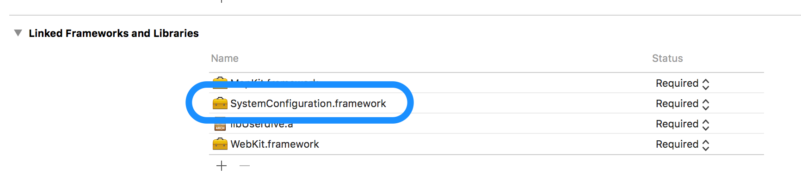
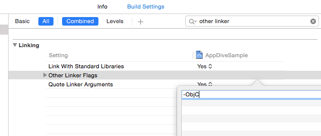

# Integration done manually

## Download the file

Download USERDIVE SDK corresponding to the platform from the following links.

- [USERDIVE iOS SDK](https://github.com/uncovertruth/userdive-ios-sdk/releases/tag/1.1.0)
- [USERDIVE iOS SDK for Unity (Unity用)](https://github.com/uncovertruth/userdive-ios-sdk-for-unity/releases/tag/v1.0.0)

## Add SDK

Decompress the file which you downloaded,
and add it to the Xcode project on application you want to analyse.

## Add framework

Add `SystemConfigurationframework` to the project.

## Change Linker option

Open the Build Settings and add `-ObjC` to Linking -> Other Linker Flags.

