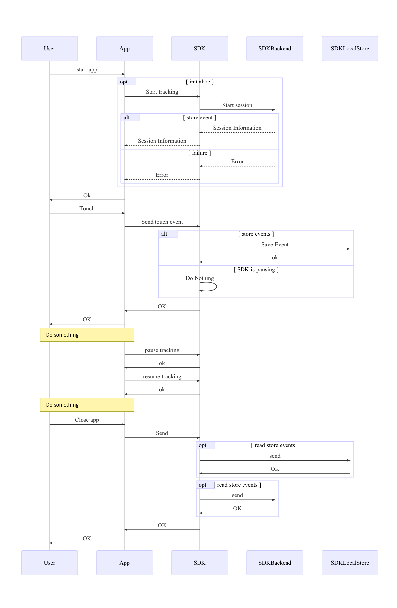

<!-- START doctoc generated TOC please keep comment here to allow auto update -->
<!-- DON'T EDIT THIS SECTION, INSTEAD RE-RUN doctoc TO UPDATE -->
**Table of Contents**  *generated with [DocToc](https://github.com/thlorenz/doctoc)*

- [Check List in advance](#check-list-in-advance)
  - [Support devices/Languages](#support-deviceslanguages)
  - [Counterplan Limitations](#counterplan-limitations)
  - [Check the App specifications](#check-the-app-specifications)
  - [SDK lifecycle](#sdk-lifecycle)
    - [状態遷移](#%E7%8A%B6%E6%85%8B%E9%81%B7%E7%A7%BB)
    - [Processing Sequence](#processing-sequence)
  - [Coverage of USERDIVE for App](#coverage-of-userdive-for-app)

<!-- END doctoc generated TOC please keep comment here to allow auto update -->

# Check List in advance

この資料のゴールは、SDKの動作を理解することと、必要な問い合わせ内容や実装方法を理解することです。    

## Support devices/Languages

USERDIVE iOS SDK v1.2.0 supports the following devices, architectures and languages.

- Support Devices
    - iPhone4
    - iPhone4s
    - iPhone5
    - iPhone5c
    - iPhone5s
    - iPhone6
    - iPhone6+
    - iPhone6s
    - iPhone6s+
- Support CPU Architectures
    - armv7
    - armv7s
    - arm64
    - i386
    - x86_64
- Support Languages
    - Objective-C
    - Swift (Should write bridging header)
- BITCODE
    - Support

## Counterplan Limitations

USERDIVE for Apps limits the number of data collected to prevent clogging on Apps which generally occurs due to unexpectedly large volumes of information.

- Limited Contents and its Value
    - Events in one screen
        - n of events = 200 (Tap and Swipe etc)
        - Time = 1 hour
    - Events per session
        - n of events = 1,200 (Tap and Swipe etc)
        - Time = 1 hour    
    - Number of sessions per month
        - *Depends on the plan*
    - Number of Daily sessions per App
        - *Depends on the value set*
    - Session each hour per App
        - *Depends on the value set*

## Check the App specifications

SDKを組み込むアプリの仕様を確認し、追加SDK、問い合わせについてご確認ください。

| Confirmation items                                                | In the case of YES                     |
|:--------------------------------------------------------|:-------------------------------------|
| Does your App have Unity?                                 | Use [Unity Plugin](https://github.com/uncovertruth/userdive-ios-sdk-for-unity)    |
| Does your App have WebView?                               | URLの組み合わせを限定するため、URLパラメータを管理画面上で制限することができます。Please contact us for more information. |
| Does your App have same screen name for different pages? | Please set unique ViewController name for each category. (Instruction will be provided) Please contact us for more information. |

## SDK lifecycle

Example of SDK lifecycle.

### 状態遷移

SDK has the following conditions.

| State Name | Action |
|:-|:-|
| Tracking | Tracking of user operation |
| Pause | Pause tracking of user operation |
| Uploading | Uploading tracking log |
| Stop | Stop action |

### Processing Sequence

SDKは`Userdive:startTracking:`呼び出すとUserdiveサーバにセッション取得を試みます。  
成功するとトラッキングを開始し、バックグラウンド移行時にログのアップロードを行います。

## Coverage of USERDIVE for App

The coverage of each function differ depending on Apps.

| Functions                     | SDK | Unity Plugin |
|:-------------------------|:----------|:----------------|
| Tap Heatmap       | ◯         | ◯             |
| Scroll Heatmap   | ◯         | ×※1          |
| Looking Heatmap   | ◯         | ×※1          |
| Other event information     | ◯         | ×※1          |
| Location Heatmap | ◯         | ×※2          |
| Funnel Analysis                 | ◯         | ◯             |
| Session Playback   | ◯         | ◯             |
| Filter Function                | ◯         | ◯             |

※1 Can not to get Scroll Heatmap, Looking Heatmap and Other event information on Unity GameView. But can get those out of Unity GameView. Please contact us for more information.

※2 Unityプラグインは通常版SDKを内包しているので、C#からObjCへのブリッジを記述することで全機能を利用することができる。
