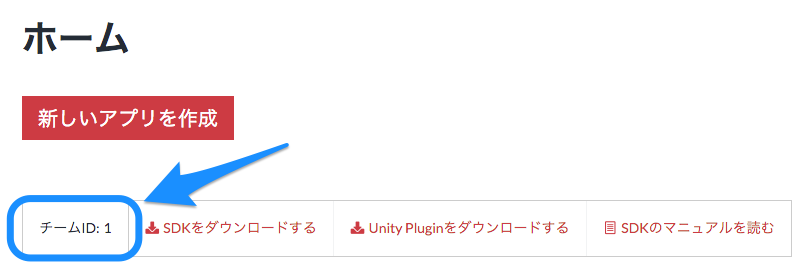
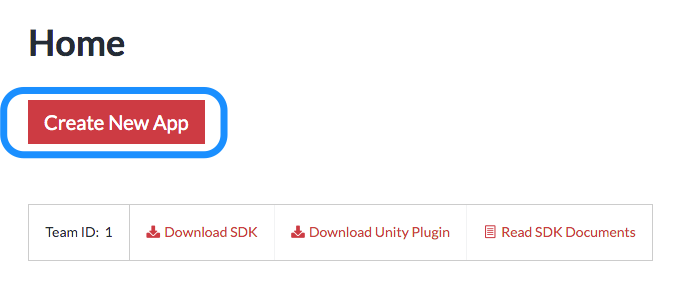
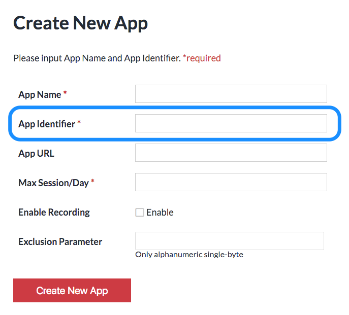

<!-- START doctoc generated TOC please keep comment here to allow auto update -->
<!-- DON'T EDIT THIS SECTION, INSTEAD RE-RUN doctoc TO UPDATE -->
**Table of Contents**  *generated with [DocToc](https://github.com/thlorenz/doctoc)*

- [To prepare](#to-prepare)
  - [Get the team ID](#get-the-team-id)
    - [Check the team ID](#check-the-team-id)
  - [Create New App](#create-new-app)

<!-- END doctoc generated TOC please keep comment here to allow auto update -->

# To prepare

## Get the team ID

### Check the team ID

Open [USERDIVE For Apps website](https://detector.userdive.com/en/apps/) and check your team ID.

## Create New App

Open [USERDIVE for Apps web site](https://detector.userdive.com/en/apps/) and create new app.

Input the followings.

- App Name
- Bundle ID **(Input the same Bundle ID as from the Xcode)**
- Max Session/Day
- Put a check mark on enable recording

Check the Bundle ID on Xcode project.   
**Input the same Bundle ID as from the Xcode.**

