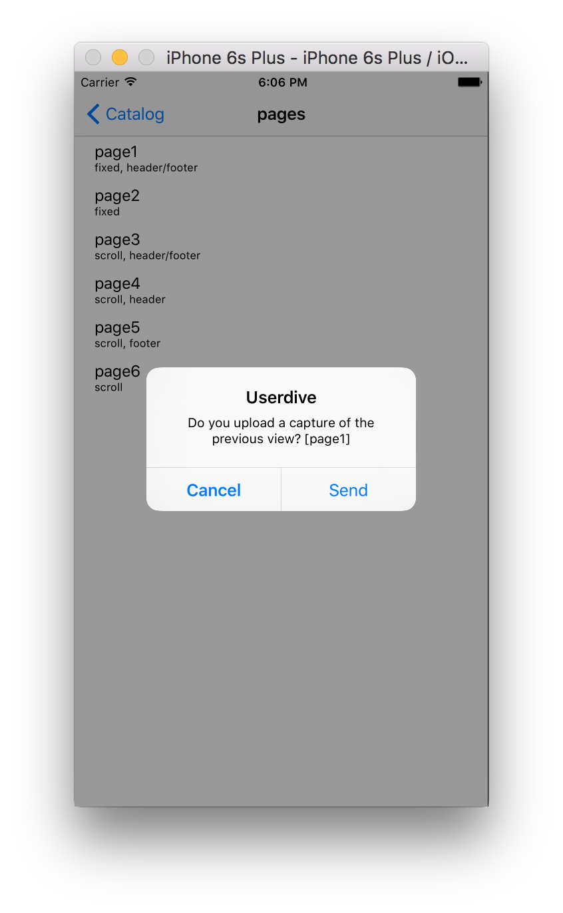
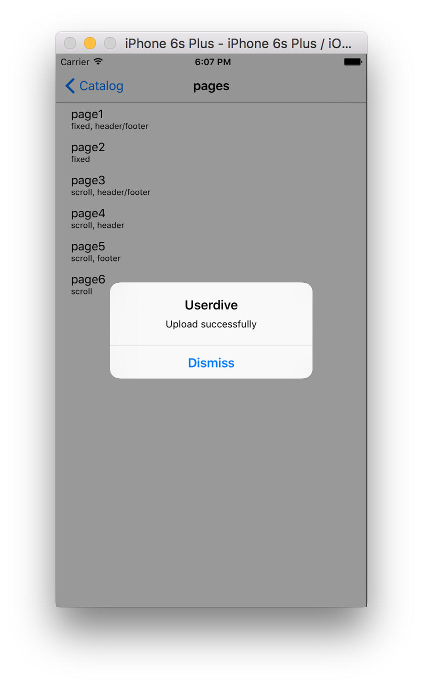

# Developer Mode

**Caution: Never use this mode on released app**

On Developer Mode, it captures screen images shown on UIWindow as a back ground image for heatmaps.


## Implimentation

### Automatically captures screen image

**Note: If capturing the screen image at voluntary timing, then follow the steps below; "Manually captures screen image"**

When UINavigationController or UITabBarController are bring used, USERDIVE reconizes the page movements automatically and upload the screen image one by one. Follow the steps below.

Import USERDIVE iOS SDK headder.

```objectivec
#import "Userdive.h"
```

Add `Userdive:startDeveloperMode:` to `AppDeletegate:application:didFinishLaunchingWithOptions:`. Make sure to put your team ID in `<YOUR_TEAM_ID>`.

```objectivec
- (BOOL)application:(UIApplication *)application didFinishLaunchingWithOptions:(NSDictionary *)launchOptions
{
  [Userdive setLogEnabled:YES];

  // START DEVELOPER MODE
  [Userdive startDeveloperMode:<your team id>];

  return YES;
}
```

When activating an app, the following pop-up shows after screen the transition to next page. 
Choose *Send* to upload screen image to USERDIVE.



The next pop-up shows whether the screen upload was succuessful or not.




### Manually captures screen image

When screen is dynamically switched, it must be notified the SDK that the screen content has been changed.
By calling `Userdive:updateScreen` on the app, SDK determins screen transition has occered.
The Implimentation is following.
画面を動的に切り替えた場合、画面表示内容が変更されたことをSDKに通知する必要があります。
アプリケーション上で  を呼び出すことで、SDKは画面遷移が実施されたと判断します。
次のように実装します。

Import USERDIVE iOS SDK headder.

```objectivec
#import "Userdive.h"
```

Add `Userdive:startDeveloperMode:trackers:` to `AppDeletegate:application:didFinishLaunchingWithOptions:`.
Make sure to put your team ID in `<YOUR_TEAM_ID>`.

```objectivec
- (BOOL)application:(UIApplication *)application didFinishLaunchingWithOptions:(NSDictionary *)launchOptions
{
  [Userdive setLogEnabled:YES];

  // START DEVELOPER MODE WITHOUT TRACKERS
  [Userdive startDeveloperMode:<your team id>
                      trackers:@[
                      [NSNumber numberWithInteger:1],
                      [NSNumber numberWithInteger:2],
                      [NSNumber numberWithInteger:3]
                      ]];

  return YES;
}
```

When the screen you want to take capture is shown, call the following method.

- Call `updateScreen` to prepare for screen image capture.
- Call `updateScreen` again to take screen image capture. (Total of two `updateScreen` is neccessary to cop .) 

```objectivec
- (void)viewDidAppear:(BOOL)animated
{
  [super viewDidAppear:animated];

  [Userdive updateScreen];
  [Userdive setScreenName:@"screen A"];
}
```

When activating an app, the following pop-up shows after screen the transition to next page. 
Choose *Send* to upload screen image to USERDIVE.


The next pop-up shows whether the screen upload was succuessful or not.


