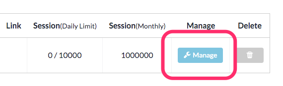
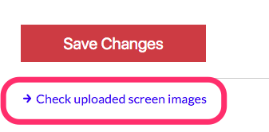
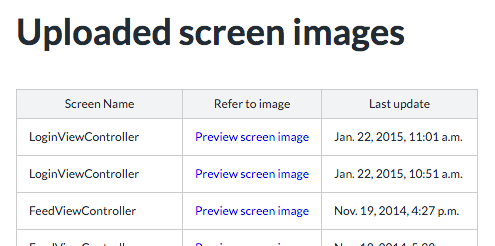

<!-- START doctoc generated TOC please keep comment here to allow auto update -->
<!-- DON'T EDIT THIS SECTION, INSTEAD RE-RUN doctoc TO UPDATE -->
**Table of Contents**  *generated with [DocToc](https://github.com/thlorenz/doctoc)*

- [SDKデベロッパモードの動作確認](#sdk%E3%83%87%E3%83%99%E3%83%AD%E3%83%83%E3%83%91%E3%83%A2%E3%83%BC%E3%83%89%E3%81%AE%E5%8B%95%E4%BD%9C%E7%A2%BA%E8%AA%8D)
  - [開始動作の確認](#%E9%96%8B%E5%A7%8B%E5%8B%95%E4%BD%9C%E3%81%AE%E7%A2%BA%E8%AA%8D)
  - [キャプチャ動作の確認](#%E3%82%AD%E3%83%A3%E3%83%97%E3%83%81%E3%83%A3%E5%8B%95%E4%BD%9C%E3%81%AE%E7%A2%BA%E8%AA%8D)
  - [アップロードされた画面キャプチャの確認](#%E3%82%A2%E3%83%83%E3%83%97%E3%83%AD%E3%83%BC%E3%83%89%E3%81%95%E3%82%8C%E3%81%9F%E7%94%BB%E9%9D%A2%E3%82%AD%E3%83%A3%E3%83%97%E3%83%81%E3%83%A3%E3%81%AE%E7%A2%BA%E8%AA%8D)

<!-- END doctoc generated TOC please keep comment here to allow auto update -->

# SDKデベロッパモードの動作確認

デベロッパモードの動作は以下を確認します。

- 動作ログ
- キャプチャのアップロード

## 開始動作の確認

デベロッパモード開始後、次のログが出力されることを確認してください。

```
2016-04-11 17:53:58.000 AppDiveSample[41018:2951170] ADVAppDive.m(205) -[ADVAppDive startDeveloperMode:trackers:] start developer mode: team_id=1
2016-04-11 17:53:58.000 AppDiveSample[41018:2951170] [Userdive][INFO] VERSION: 1.2.0 ()
2016-04-11 17:53:58.001 AppDiveSample[41018:2951170] [Userdive][INFO] FOR DEVELOPMENT ONLY! start capturing (team_id=1)
```


## キャプチャ動作の確認

画面が遷移するとキャプチャが行われます。
アップロードダイアログの表示と、アップロード成功後の表示を確認してください。

アップロードの確認は次のようになります。


アップロードに成功すると次のダイアログが表示されます。
また、後述のログ出力も確認してください。


```
2016-04-11 18:07:01.909 AppDiveSample[41018:2951170] ADVResourceAPIClient.m(34) -[ADVResourceAPIClient init] Resource API Base URL=https://detector.userdive.com/
2016-04-11 18:07:01.924 AppDiveSample[41018:2951170] ADVAPIClient.m(62) -[ADVAPIClient postToPath:dictionary:onSuccess:onFailure:] request to https://detector.userdive.com/webapi/image/upload/
2016-04-11 18:07:03.327 AppDiveSample[41018:2993544] ADVAPIClient.m(104) __58-[ADVAPIClient postToPath:dictionary:onSuccess:onFailure:]_block_invoke response code: 200
2016-04-11 18:07:03.328 AppDiveSample[41018:2993544] ADVAPIClient.m(105) __58-[ADVAPIClient postToPath:dictionary:onSuccess:onFailure:]_block_invoke response body: {"status": "OK"}
```

## アップロードされた画面キャプチャの確認

アップロードされた画面キャプチャは管理画面上で確認することができます。
アプリの設定を開きます。



下部の `アップロード済み画面キャプチャの確認` を開きます。



画面名と画面キャプチャの一覧が表示されます。
`画面イメージを表示` をクリックすると、アップロード済みの画面キャプチャが表示されます。


