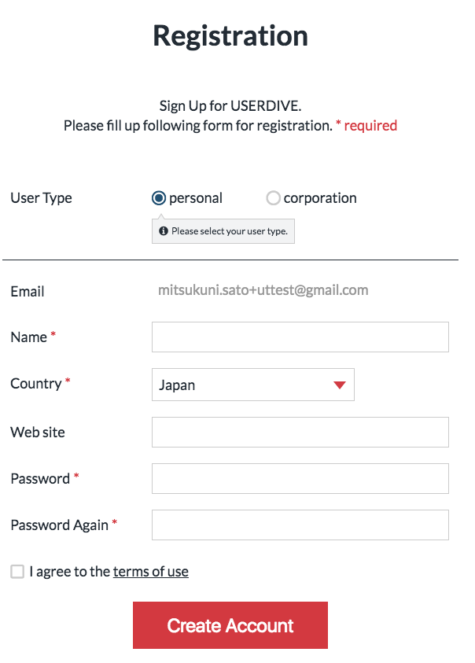
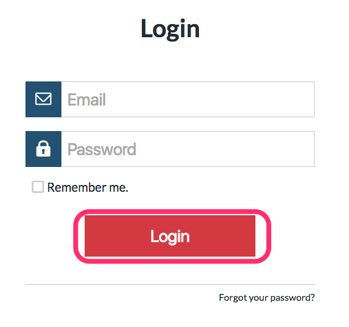

# アカウント登録

1. ブラウザで[detector.userdive.com](https://detector.userdive.com)を開いてください
1. 登録したいメールアドレスを入力して **Create Account** をクリックしてください
    - 
    - 
1. 入力した登録確認メールに含まれるURLを開き、フォームに必要な内容を入力して **Create Account** をクリックしてください
    - 
1. ログインフォームにメールアドレス、パスワードを入力して **Login** をクリックします
    - 
