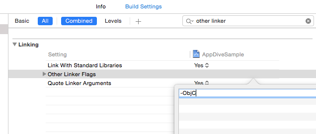

<!-- START doctoc generated TOC please keep comment here to allow auto update -->
<!-- DON'T EDIT THIS SECTION, INSTEAD RE-RUN doctoc TO UPDATE -->
**Table of Contents**  *generated with [DocToc](https://github.com/thlorenz/doctoc)*

- [手動インストール](#%E6%89%8B%E5%8B%95%E3%82%A4%E3%83%B3%E3%82%B9%E3%83%88%E3%83%BC%E3%83%AB)
  - [ファイルダウンロード](#%E3%83%95%E3%82%A1%E3%82%A4%E3%83%AB%E3%83%80%E3%82%A6%E3%83%B3%E3%83%AD%E3%83%BC%E3%83%89)
  - [SDKの追加](#sdk%E3%81%AE%E8%BF%BD%E5%8A%A0)
  - [フレームワークの追加](#%E3%83%95%E3%83%AC%E3%83%BC%E3%83%A0%E3%83%AF%E3%83%BC%E3%82%AF%E3%81%AE%E8%BF%BD%E5%8A%A0)
  - [リンカオプションの変更](#%E3%83%AA%E3%83%B3%E3%82%AB%E3%82%AA%E3%83%97%E3%82%B7%E3%83%A7%E3%83%B3%E3%81%AE%E5%A4%89%E6%9B%B4)

<!-- END doctoc generated TOC please keep comment here to allow auto update -->

# 手動インストール

## ファイルダウンロード

次のリンクからプラットフォームに対応したUSERDIVE SDKをダウンロードします。

- [USERDIVE iOS SDK](https://github.com/uncovertruth/userdive-ios-sdk/releases/tag/1.1.0)
- [USERDIVE iOS SDK for Unity (Unity用)](https://github.com/uncovertruth/userdive-ios-sdk-for-unity/releases/tag/v1.0.0)

## SDKの追加

ダウンロードしたファイルを解凍して対象アプリのXcodeプロジェクトに追加します。

## フレームワークの追加

プロジェクトに`SystemConfigurationフレームワーク`を追加します。

## リンカオプションの変更

Build Settingsを開き、Linking -> Other Linker Flagsに`-ObjC`を追加します。

