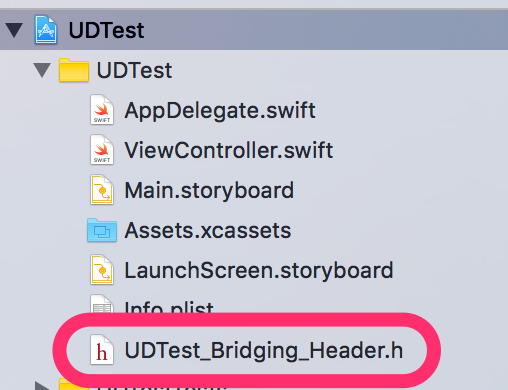
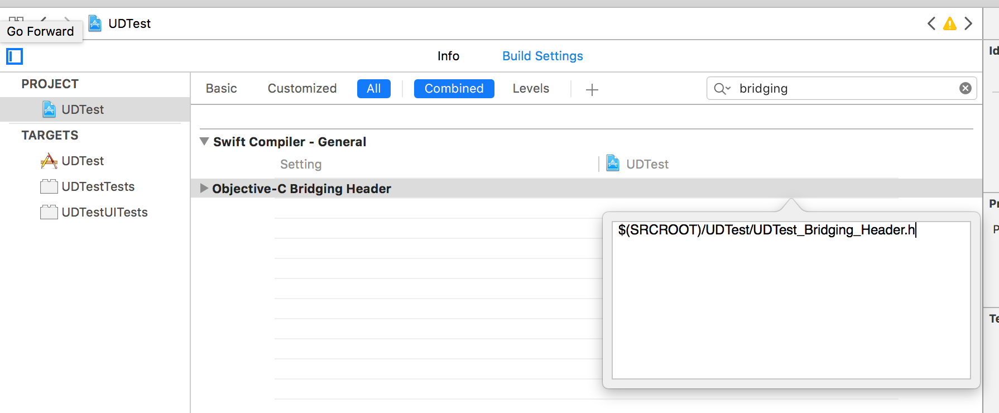

# Swift環境への組込

USERDIVE iOS SDKはObjective-Cで作成されたライブラリですので、
Swift環境で利用するためにはブリッジングヘッダを作成する必要があります。

ブリッジングヘッダが無い場合、 *アプリ名* + `_Bridging_Header.h` という名前で作成します。



次の内容を書き込みます（ `AppName` の部分は自身のアプリ名に置き換えてください）。

```objectivec
#ifndef AppName_Bridging_Header_h
#define AppName_Bridging_Header_h

#import "Userdive.h"

#endif /* AppName_Bridging_Header_h */
```

次に、プロジェクトでブリッジングヘッダを参照するため *Project -> Build Settings -> Objective-C Bridging Header* に `$(SRCROOT)/AppName/AppName_Bridging_Header.h` と記述してください。



以上の設定で、SwiftからUSERDIVEを呼び出すことが出来るようになります。