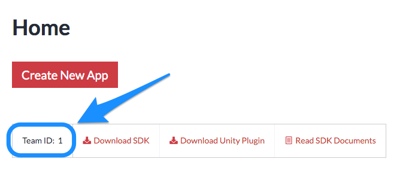
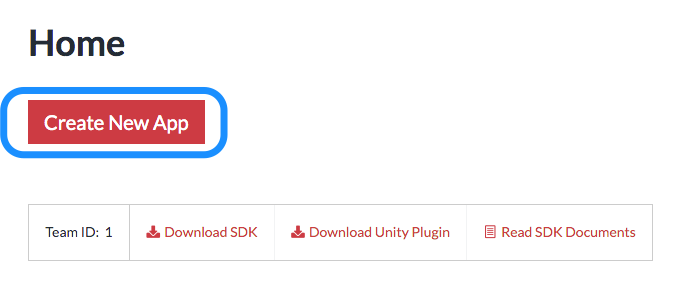

<!-- START doctoc generated TOC please keep comment here to allow auto update -->
<!-- DON'T EDIT THIS SECTION, INSTEAD RE-RUN doctoc TO UPDATE -->
**Table of Contents**  *generated with [DocToc](https://github.com/thlorenz/doctoc)*

- [下準備](#%E4%B8%8B%E6%BA%96%E5%82%99)
  - [チームIDの取得](#%E3%83%81%E3%83%BC%E3%83%A0id%E3%81%AE%E5%8F%96%E5%BE%97)
    - [チームIDを確認する](#%E3%83%81%E3%83%BC%E3%83%A0id%E3%82%92%E7%A2%BA%E8%AA%8D%E3%81%99%E3%82%8B)
  - [アプリの登録](#%E3%82%A2%E3%83%97%E3%83%AA%E3%81%AE%E7%99%BB%E9%8C%B2)

<!-- END doctoc generated TOC please keep comment here to allow auto update -->

# 下準備

## チームIDの取得

### チームIDを確認する

[USERDIVE For Apps website](https://detector.userdive.com/en/apps/)を開いてあなたのチームIDを確認します。

## アプリの登録

[USERDIVE for Appsのウェブサイト](https://detector.userdive.com/en/apps/)を開き、アプリの新規登録を実施します。

以下の項目を入力して作成してください。

- アプリ名
- Bundle ID **(インストールする際に使用する正しい値を入力してください)**
- 最大セッション数
- セッション記録を行うをチェック

XcodeプロジェクトでBundle IDを確認します。
**Bundle IDはUSERDIVE上に登録された値と同一でなければなりません。**

