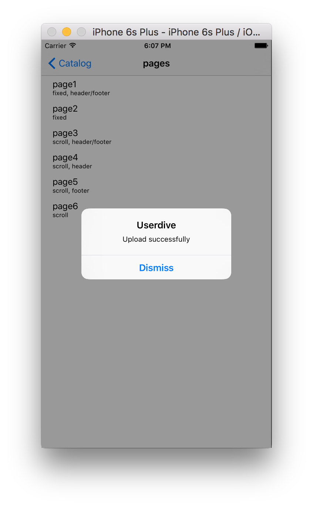

# 手動で画面イメージを取得する

ビューの切替をSDK任せではなく手動で行う方法です。
自動取得がうまくいかない場合にはこちらの方法を検討してください。

## 組込手順

### Objective-C

USERDIVE iOS SDKヘッダーをインポートします。

```objective-c
#import "Userdive.h"
```

`AppDeletegate:application:didFinishLaunchingWithOptions:` に
下記の例に従い`Userdive:startDeveloperMode:trackers:` を追加します。
`trackers`の引数に注意してください。
また、 `<YOUR_TEAM_ID>` にはあなたのチームIDを入れてください。

```objective-c
- (BOOL)application:(UIApplication *)application didFinishLaunchingWithOptions:(NSDictionary *)launchOptions
{
  // Enable debug logging
  [Userdive setLogEnabled:YES];

  // START DEVELOPER MODE WITHOUT TRACKERS
  [Userdive startDeveloperMode:<YOUR_TEAM_ID>
                      trackers:@[
                      [NSNumber numberWithInteger:1],
                      [NSNumber numberWithInteger:2],
                      [NSNumber numberWithInteger:3]
                      ]];

  return YES;
}
```

アプリケーション上で `Userdive:updateScreen` を呼び出すと、
ビューが変更されたことをSDKに通知します。

画面キャプチャを取得したい画面が表示されたら、次のようにメソッドを呼び出してください。

- `updateScreen`を呼び出すと、画面キャプチャ取得の準備を行います
- 再度 `updateScreen` を呼び出すと画面キャプチャを取得します（つまり、キャプチャを取得するまでに合計二度 `updateScreen`を呼び出す必要があります）

```objective-c
- (void)viewDidAppear:(BOOL)animated
{
  [super viewDidAppear:animated];

  [Userdive updateScreen];
  [Userdive setScreenName:@"screen A"];
}
```

### Swift

`AppDelegate.swift` 内に
`Userdive.startDeveloperMode(<YOUR_TEAM_ID>, trackers: [Int])`
を追加します。`trackers`の引数に注意してください。
また、 `<YOUR_TEAM_ID>` にはあなたのチームIDを入れてください。

```swift
func application(application: UIApplication, didFinishLaunchingWithOptions launchOptions: [NSObject: AnyObject]?) -> Bool {
  // Enable debug logging
  Userdive.setLogEnabled(true)

  // START DEVELOPER MODE
  Userdive.startDeveloperMode(TEAM_ID, trackers: [1, 2, 3])
  return true
}
```

アプリケーション上で `Userdive.updateScreen()` を呼び出すと、
ビューが変更されたことをSDKに通知します。

画面キャプチャを取得する画面が表示されたら、次のようにメソッドを呼び出してください。

- `updateScreen()`を呼び出すと、画面キャプチャ取得の準備を行います
- もう一度 `updateScreen()` を呼び出すと画面キャプチャを取得します（つまり、キャプチャを取得するまでに合計二度 `updateScreen()`を呼び出す必要があります）

```swift
override func viewDidAppear(animated: Bool) {
  super.viewDidAppear(animated)

  Userdive.updateScreen()
  Userdive.setScreenName("screen A")
}
```

## 画面イメージ取得

アプリを起動すると画面遷移後、キャプチャ取得時に確認ダイアログが表示されるので、
*送信* ボタンをタップして画面イメージをUSERDIVEにアップロードします。


画面キャプチャのアップロード状態はダイアログで表示されます。


