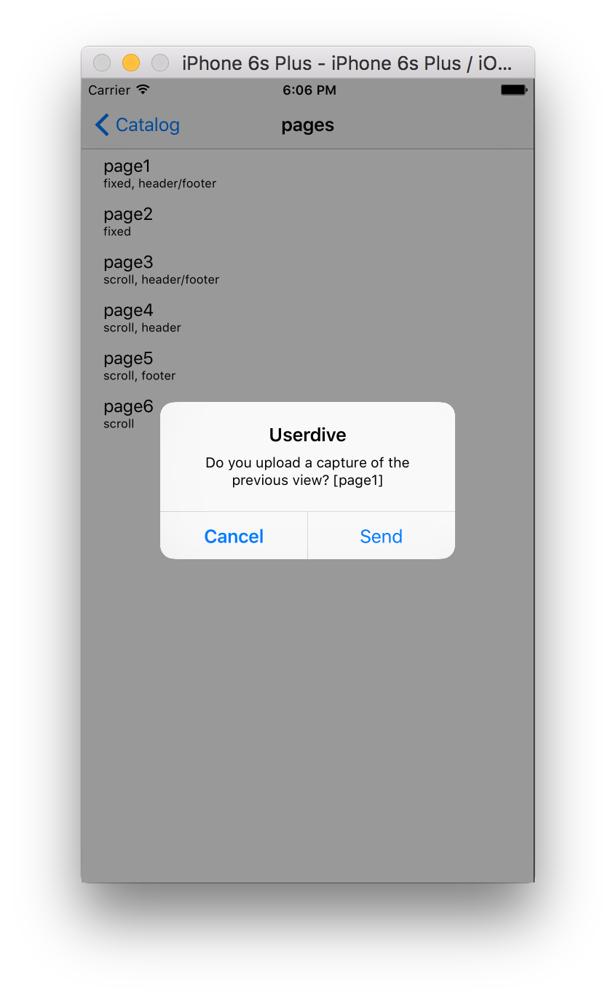

# SDKデベロッパモードの動作確認

デベロッパモードの動作は以下を確認します。

- 動作ログ
- キャプチャのアップロード

## 開始動作

デベロッパモード開始後、次のログが出力されることを確認してください。

```
2016-04-11 17:53:58.000 AppDiveSample[41018:2951170] ADVAppDive.m(205) -[ADVAppDive startDeveloperMode:trackers:] start developer mode: team_id=1
2016-04-11 17:53:58.000 AppDiveSample[41018:2951170] [Userdive][INFO] VERSION: 1.2.0 ()
2016-04-11 17:53:58.001 AppDiveSample[41018:2951170] [Userdive][INFO] FOR DEVELOPMENT ONLY! start capturing (team_id=1)
```

## トラッキング動作

画面遷移やUIオブジェクトの操作など、アプリを操作してください。
次のようなログが出力されることを確認してください。

```
2016-04-11 18:05:17.116 AppDiveSample[41018:2951170] ADVLogManager.m(60) -[ADVLogManager logEvent:] {
    area = main;
    event = tap;
    "screen_count" = 0;
    "screen_x" = 102;
    "screen_y" = 93;
    timestamp = "2016-04-11T09:05:17.115";
    x = 102;
    y = 30;
}
2016-04-11 18:05:17.119 AppDiveSample[41018:2951170] ADVLogManager.m(60) -[ADVLogManager logEvent:] {
    event = ui;
    row = 0;
    "screen_count" = 0;
    section = 0;
    timestamp = "2016-04-11T09:05:17.118";
    type = tableView;
}
2016-04-11 18:05:17.661 AppDiveSample[41018:2951170] ADVLogManager.m(60) -[ADVLogManager logEvent:] {
    action = close;
    event = screen;
    meta =     {
        "looking_time" =         (
                        {
                bottom = 672;
                time = 679597;
                top = 0;
            }
        );
        "next_screen_name" = PageListViewController;
        orientation = portrait;
        "previous_screen_name" = "<null>";
        "screen_exit_time" = "2016-04-11T09:05:17.661";
        "screen_start_time" = "2016-04-11T08:53:58.062";
        "screen_staying_time" = "679.5989570021629";
        "scroll_reached" = 736;
    };
    "screen_count" = 0;
    "screen_name" = CatalogViewController;
    timestamp = "2016-04-11T09:05:17.661";
}
```

## キャプチャ動作

画面が遷移するとキャプチャが行われます。
アップロードダイアログの表示と、アップロード成功後の表示を確認してください。

アップロードの確認は次のようになります。



アップロードに成功すると次のダイアログが表示されます。
また、後述のログ出力も確認してください。


```
2016-04-11 18:07:01.909 AppDiveSample[41018:2951170] ADVResourceAPIClient.m(34) -[ADVResourceAPIClient init] Resource API Base URL=https://detector.userdive.com/
2016-04-11 18:07:01.924 AppDiveSample[41018:2951170] ADVAPIClient.m(62) -[ADVAPIClient postToPath:dictionary:onSuccess:onFailure:] request to https://detector.userdive.com/webapi/image/upload/
2016-04-11 18:07:03.327 AppDiveSample[41018:2993544] ADVAPIClient.m(104) __58-[ADVAPIClient postToPath:dictionary:onSuccess:onFailure:]_block_invoke response code: 200
2016-04-11 18:07:03.328 AppDiveSample[41018:2993544] ADVAPIClient.m(105) __58-[ADVAPIClient postToPath:dictionary:onSuccess:onFailure:]_block_invoke response body: {"status": "OK"}
```