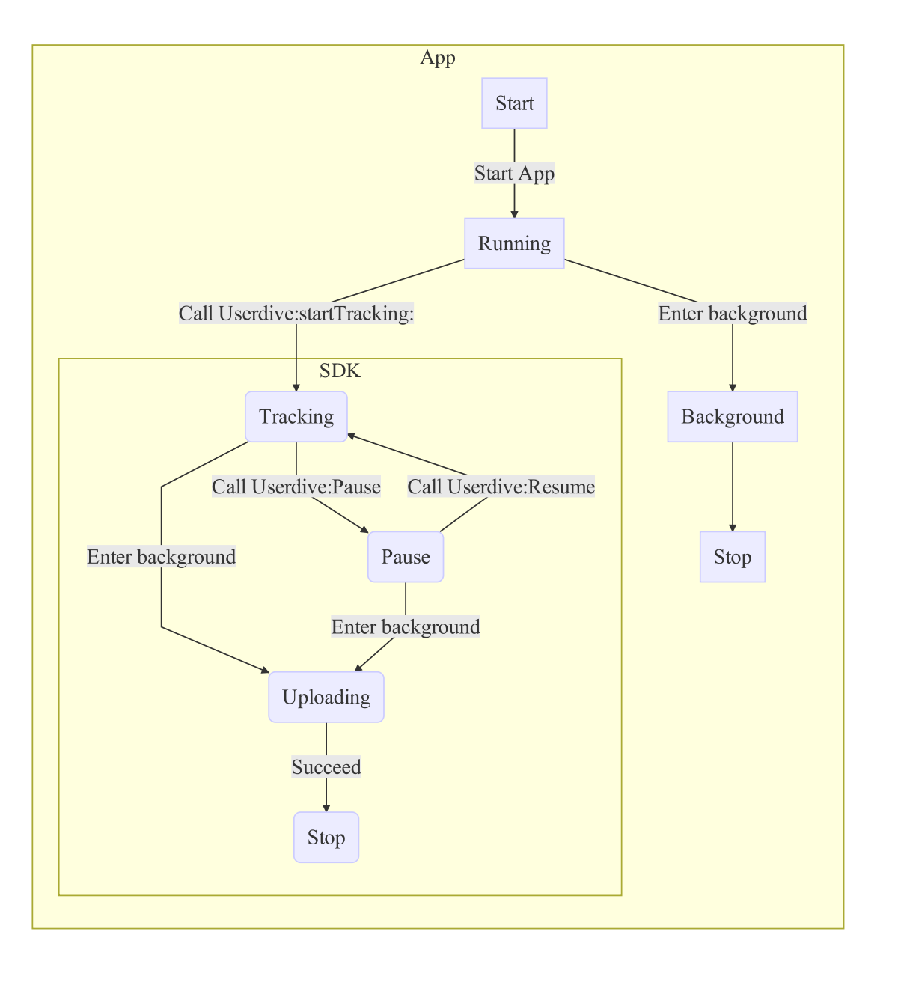
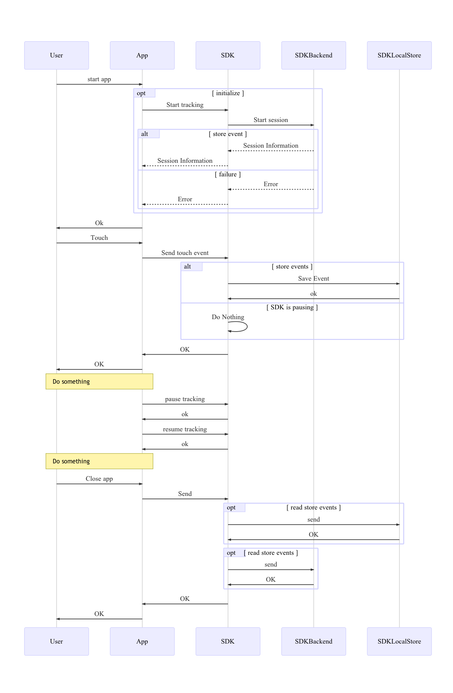

# 事前チェックリスト

この資料のゴールは、SDKの動作と実装方法を理解することです。

## 対応機種 / 言語

USERDIVE iOS SDK v1.2.0は以下の機種およびアーキテクチャ、言語に対応しています。

- 対応機種
    - iPhone4
    - iPhone4s
    - iPhone5
    - iPhone5c
    - iPhone5s
    - iPhone6
    - iPhone6+
    - iPhone6s
    - iPhone6s+
- 対応CPUアーキテクチャ
    - armv7
    - armv7s
    - arm64
    - i386
    - x86_64
- 対応言語
    - Objective-C
    - Swift (bridging headerを書く必要があります)
- BITCODE
    - 対応

## 制限事項

トラッキングイベント数やセッション数には次の上限があります。

- トラッキングの制限
    - 画面あたりの制限
        - 最大200イベント
        - 最大5分
    - セッションあたりの制限
        - 最大1200イベント
        - 最大1時間
    - 1か月あたりのセッション数
        - 契約内容による
    - 1日あたりのセッション数（アプリ別）
        - 契約内容による
    - 1時間あたりのセッション数（アプリ別）
        - 契約内容による
- 画面名の最大文字数
    - 100文字

## アプリ仕様確認

SDKを組み込むアプリの仕様を確認し、追加するSDKの種類や問い合わせ内容についてご確認ください。

| 確認項目                                                | 利用している場合                                                                                                                 |
|:--------------------------------------------------------|:---------------------------------------------------------------------------------------------------------------------------------|
| Unityを使用していますか                                 | [Unityプラグイン](https://github.com/uncovertruth/userdive-ios-sdk-for-unity)をご利用ください。                                  |
| WebViewを利用していますか                               | URLの組み合わせを限定するため、URLパラメータを管理画面上で制限することができます。詳しくはUncoverTruthまでお問い合わせください。 |
| 1つのビューコントローラで複数のビューを描画していますか | ビュー毎（ViewController毎）に一意の画面名を付ける必要があります。詳しくはUncoverTruthまでお問い合わせください。                 |

## SDKライフサイクル

SDKのライフサイクルについて。

### 状態遷移

SDKは以下の状態を持ちます。

| 状態名    | 動作                                 |
|:----------|:-------------------------------------|
| Tracking  | ユーザ操作のトラッキング中。         |
| Pause     | ユーザ操作のトラッキングを一時中断。 |
| Uploading | トラッキングログをアップロード中。   |
| Stop      | 停止状態                             |

### 処理シーケンス

SDKは`Userdive:startTracking:`呼び出すとUserdiveサーバにセッション取得を試みます。
成功するとトラッキングを開始し、バックグラウンド移行時にログのアップロードを行います。

## 通常版SDK / Unityプラグインの違い

通常版SDKとUnityプラグインでは動作が異なります。

| 機能                     | 通常版SDK | Unityプラグイン |
|:-------------------------|:----------|:----------------|
| タップヒートマップ       | ◯         | ◯               |
| スクロールヒートマップ   | ◯         | ×※1             |
| ルッキングヒートマップ   | ◯         | ×※1             |
| その他のイベント情報     | ◯         | ×※1             |
| ロケーションヒートマップ | ◯         | ×※2             |
| 導線分析                 | ◯         | ◯               |
| セッションプレイバック   | ◯         | ◯               |
| フィルタ                 | ◯         | ◯               |

※1 Unity GameView内ではスクロールヒートマップ、ルッキングヒートマップ、その他のイベント情報は取得できません。GameView以外では取得することができます。詳しくはお問い合わせください。

※2 Unityプラグインは通常版SDKを内包しているので、C#からObjCへのブリッジを記述することで全機能を利用することができる。
