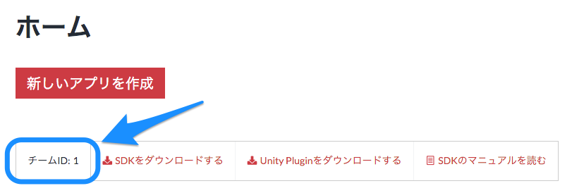
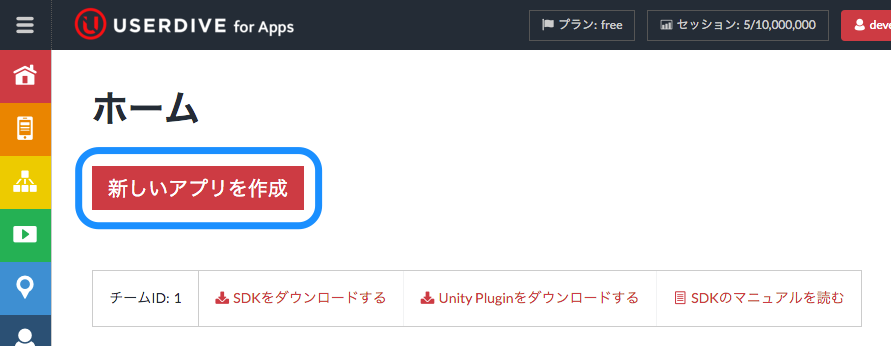
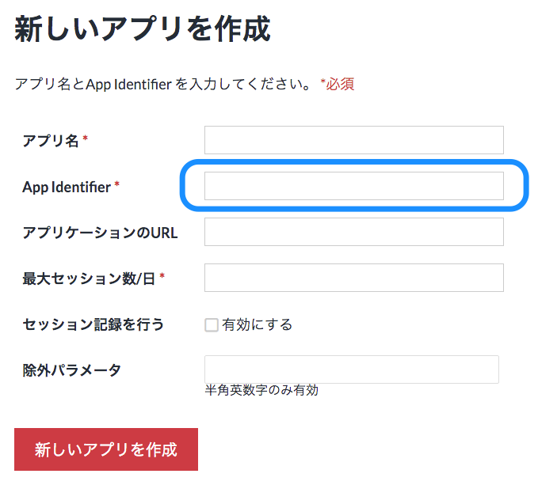

# 下準備

## チームIDの取得

### チームIDを確認する

[USERDIVE For Apps website](https://detector.userdive.com/en/apps/)を開いてあなたのチームIDを確認します。

## アプリの登録

[USERDIVE for Appsのウェブサイト](https://detector.userdive.com/en/apps/)を開き、アプリの新規登録を実施します。

以下の項目を入力して作成してください。

- アプリ名
- Bundle ID **(インストールする際に使用する正しい値を入力してください)**
- 最大セッション数
- セッション記録を行うをチェック

XcodeプロジェクトでBundle IDを確認します。
**Bundle IDはUSERDIVE上に登録された値と同一でなければなりません。**

