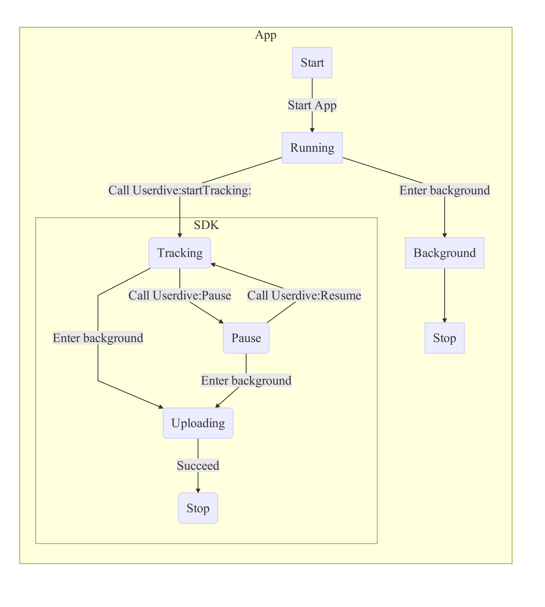

# SDKライフサイクル

## 状態遷移

SDKは以下の状態を持ちます。

| 状態名    | 動作                                   |
|:----------|:---------------------------------------|
| Tracking  | ユーザー操作のトラッキング中。         |
| Pause     | ユーザー操作のトラッキングを一時中断。 |
| Uploading | トラッキングログをアップロード中。     |
| Stop      | 停止状態                               |

## 処理シーケンス

SDKは`Userdive:startTracking:`呼び出すとUserdiveサーバーにセッション取得を試みます。
成功するとトラッキングを開始し、バックグラウンド移行時にログのアップロードを行います。

