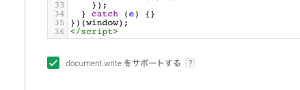
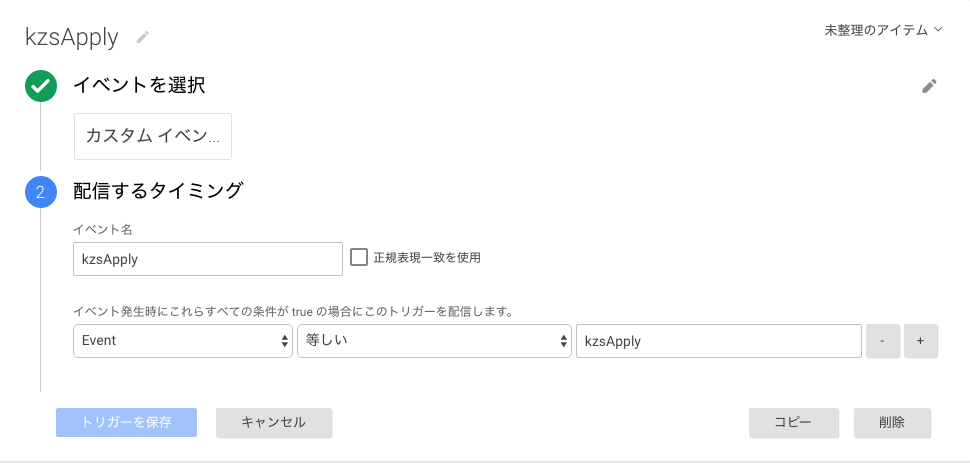

<!-- START doctoc generated TOC please keep comment here to allow auto update -->
<!-- DON'T EDIT THIS SECTION, INSTEAD RE-RUN doctoc TO UPDATE -->
**Table of Contents**  *generated with [DocToc](https://github.com/thlorenz/doctoc)*

- [Kaizen Platform 連携(Google Tag Manager利用)](#kaizen-platform-%E9%80%A3%E6%90%BAgoogle-tag-manager%E5%88%A9%E7%94%A8)
  - [必要なタグ](#%E5%BF%85%E8%A6%81%E3%81%AA%E3%82%BF%E3%82%B0)
    - [Kaizen Platform スニペット](#kaizen-platform-%E3%82%B9%E3%83%8B%E3%83%9A%E3%83%83%E3%83%88)
    - [USERDIVE ロードタグ](#userdive-%E3%83%AD%E3%83%BC%E3%83%89%E3%82%BF%E3%82%B0)
    - [Kaizen Platform/USERDIVE 連携タグ](#kaizen-platformuserdive-%E9%80%A3%E6%90%BA%E3%82%BF%E3%82%B0)

<!-- END doctoc generated TOC please keep comment here to allow auto update -->

# Kaizen Platform 連携(Google Tag Manager利用)

`Google Tag Manager` を利用し下記のタグを反映することにより、 USERDIVE にテスト情報を引き渡すことができます。

また、こちらの手順では `Google Tag Manager` が提供する `dataLayer` の機能を用いてテスト情報の引き渡しを行います。

- [(Google Tag Manager examples)](https://uncovertruth.github.io/examples/integration/kaizenplatform_with_gtm.html)

## 必要なタグ

- Kaizen Platform `dataLayer` push タグ
- USERDIVE ロードタグ
- USERDIVE `dataLayer` pop タグ

### Kaizen Platform スニペット

Kaizen Platfom の通常のスニペットと、下記のタグを合わせて設定します。
下記のコードで行われる主な役割は以下の2つです。

1. Kaizen Platform がテストの内容を決定する
1. 決定された情報を `dataLayer` に対して `event` 名を `kzsApply` として登録



こちらのスニペットは `Google Tag Manager` 上で `document.write` を有効にする必要があります。

### USERDIVE ロードタグ

USERDIVE ロードタグの反映が必要です。



USERDIVE ロードタグは、 下記 `Kaizen Platform/USERDIVE連携タグ` よりも前に存在している必要があります。

### Kaizen Platform/USERDIVE 連携タグ

Kaizen Platform 連携タグの反映には下記の2つが必要です。

1. `Google Tag Manager` 上でトリガーに対し **カスタムイベント** を追加する
    
1. 下記のコードを配信するタグに登録し、トリガーを **作成したカスタムイベント** のもので登録し、配信を行う



| Field        | Type   | Required | Description                     |
|:-------------|:-------|:---------|:--------------------------------|
| [Project Id] | String | Yes      | USERDIVE のプロジェクトIDです。 |
