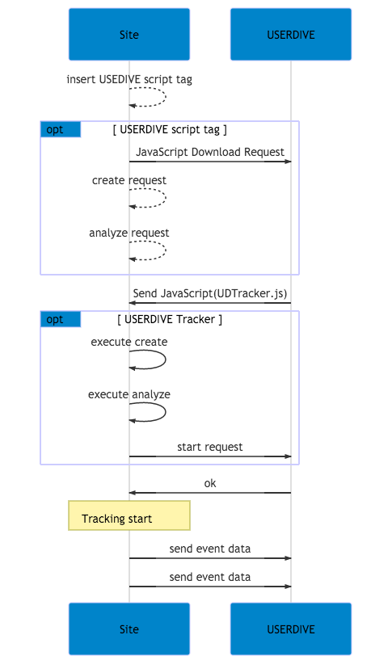

# `analyze` API

サイトの計測を開始します。
`analyze` APIを実行する前に、必ず `create` API をご利用ください。
サイトの計測には USERDIVE のアカウント情報が必要です。

- [`create` API について](./create.html)

```html
<script>
ud("analyze");
</script>
```

上記のコードで行われる主な処理は下記の

1. アカウント情報を USERDIVE に問い合わせし、セッションを作成する。
1. 下記、イベント・ユーザー情報の計測を開始する。
    - ユーザーの環境情報: IP アドレス、ユーザーエージェントから識別可能な情報
        - 国、地域
        - デバイス種別
        - OS種別
        - ブラウザー種別
        - 画面サイズ
    - ユーザーが表示しているページの情報
        - 表示されている URL
        - ブラウザーのウィンドウサイズ
        - ウェブページのサイズ
        - ウェブページ内のフォーム数、インプット項目情報
    - ユーザーが操作したイベント情報
        - マウスイベント (座標、クリック、ボタン情報)
        - タップイベント (座標)
        - デバイスの回転イベント
        - キーボード操作イベント (キーが押されたかのみ、どのキーが押されたかは収集対象外)
        - スクロールイベント
        - JavaScript エラー情報
        - 次ページヘの遷移イベント
        - イベント発生時刻
1. イベントデータの送信を行う

送信されたイベントデータは一定時間たった後、 USERDIVE に反映されます。

## Network

<!-- Created by draw.io  -->


## sequence diagram

`analyze` API では二種類のAPI通信が行われます。

- `//harpoon3.userdive.com/v2/ping`
    - `analyze` を実行し、設定確認・計測開始を行います。
    - 設定の例外には下記のようなものがあります。
        - `E_TRACK_SET_NOT_TRACKING_TARGET`
            - DOMAINのstatusが0、もしくは有効なDomainが見つからなかった
        - `E_TRACK_PARAM_NOT_ENOUGH`
        - `E_TRACK_PROJECT_NOT_FOUND`
            - `create` API で適切な設定が行われなかった
            - Project ID の設定に誤りがある
        - `E_TRACK_OVER_PAGEVIEWS`
            - 時間内／月内のpageview上限に到達している
        - `E_TRACK_EXCLUDE_IP`
            - IPが除外対象に設定されている
- `//harpoon3.userdive.com/v2/events`
    - 取得したイベント・ユーザー情報を送信する


