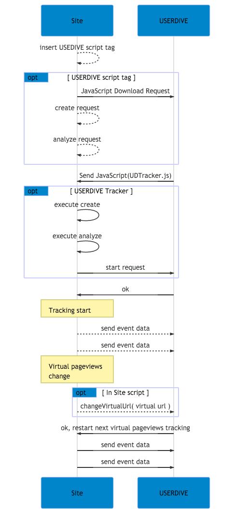
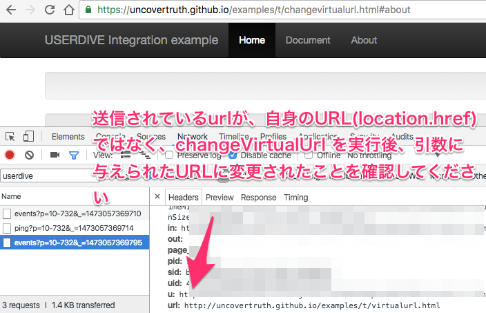

# `changeVirtualUrl` API

USERDIVE では、ユーザーの起こしたアクションを URL (`window.location.href`) 単位に集約し、分析を行うことができます。

[(example)](https://uncovertruth.github.io/examples/t/changevirtualurl.html)

USERDIVE では同一のURLで動的に要素の追加を行うサイトの分析も行うことができます。

```html
<script>
ud("changeVirtualUrl", "[ Virtual Url ]");
</script>
```

| Field       | Type   | Required | Description                                                |
|:------------|:-------|:---------|:-----------------------------------------------------------|
| Virtual URL | String | Yes      | 現在の状態の[仮想ページ](../../../guide/snapshot.html) URL |

`changeVirtualUrl` API は下記のようなページでの利用を推奨しています。

- ページの遷移を行わず表示の要素が変化するサイト
- Ajaxなどの非同期通信を利用したサイト
- JavaScript フレームワークを利用したサイト
    - AngularJS
    - Backbone.js
    - Ember.js
    - jQuery
    - React.js
    - Vue.js
    - etc

## sequence diagram



## サポート外の項目

`changeVirtualUrl` API を利用した分析では、下記のことをサポートしていません。

- フォーム分析、およびそれに関係するイベントの計測

## 確認方法

[(example)](https://uncovertruth.github.io/examples/t/changevirtualurl.html) を例に確認方法について記載します。
確認には DeveloperTools などを用います。

examples ではヘッダー内に存在している `About` をクリックすることにより、 `changeVirtualUrl` を実行します。

1. `//harpoon3.userdive.com/tracking.php` への送信データに含まれる `attr[url]` の値を確認ください。
1. `changeVirtualUrl` を実行後、引数で与えられたURLに `attr[url]` の値が変更されていることを確認してください。


