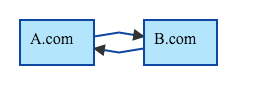

# iframe を用いたクロスドメインの設定

USERDIVE では、 iframe を用いたセッション継続のAPIを提供します。

[(examples)](http://uncovertruth.github.io/examples/gtm/iframe/)

## `addIframe` API

```html
<script>
ud("create", "[ Project Id ]", {
  "addIframe": "[ Iframe source URL ]"
});
</script>
```

### addIFrame Parameters

| Field             | Type   | Required | Description                                       |
|:------------------|:-------|:---------|:--------------------------------------------------|
| Project Id        | String | Yes      | USERDIVE のプロジェクトIDです。                   |
| Iframe source URL | String | No       | クロスドメインに利用するページのURLを指定します。 |

### 詳細説明

USERDIVE では `cookie` を用いたセッション継続を行います。

`addIFrame` API では、`Iframe source URL` のドメインに対して `cookie` を発行します。



- `A.com` から `B.com` へ遷移する場合
    - `A.com` に `addIframe`
        - `B.com` のドメインを利用した `Iframe source URL`
    - `B.com` に
- `A.com`, `B.com` 相互に遷移する場合
    - `A.com`, `B.com` に `addIframe`, [`sessionIgnores`](./sessionignores.html)
        - `A.com` に `B.com` のドメインを利用した `Iframe source URL`
        - `B.com` に `A.com` のドメインを利用した `Iframe source URL`

## `Iframe source URL`

`iframe source URL` には下記の点に注意する必要があります

- `addCookieFromUDC` API を利用した HTML(下記を推奨)

### `addCookieFromUDC` API

```html
<!DOCTYPE html>
<html>
<head>
  <title>ud</title>
  <meta http-equiv="Content-Type" content="text/html; charset=utf-8">
  <meta http-equiv="X-UA-Compatible" content="IE=edge">
  <meta http-equiv="P3P" content="CP='CAO PSA OUR'">
</head>
<body>
<script>
(function(e,t,n,c,r,a,s,u){e.USERDIVEObject=r;e[r]=e[r]||function(){(e[r].queue=e[r].queue||[]).push(arguments)};
s=t.createElement(n);u=t.getElementsByTagName(n)[0];s.async=1;s.src=c;s.charset=a;u.parentNode.insertBefore(s,u)
})(window,document,"script","//harpoon3.userdive.com/static/UDTracker.js?"+(new Date).getTime(),"ud","UTF-8");
ud("addCookieFromUDC", "[ Cookie Domain ]");
</script>
</body>
</html>
```

### 注意点

- `Iframe source URL` のページに対して、 下記のヘッダーを指定することを推奨します。

```http
P3P: CP='CAO PSA OUR’
```

### addCookieFromUDC Parameters

| Field        | Type   | Required | Description                                             |
|:-------------|:-------|:---------|:--------------------------------------------------------|
| CookieDomain | String | No       | [Cookie ドメイン](./create/cookie.html)を変更できます。 |
